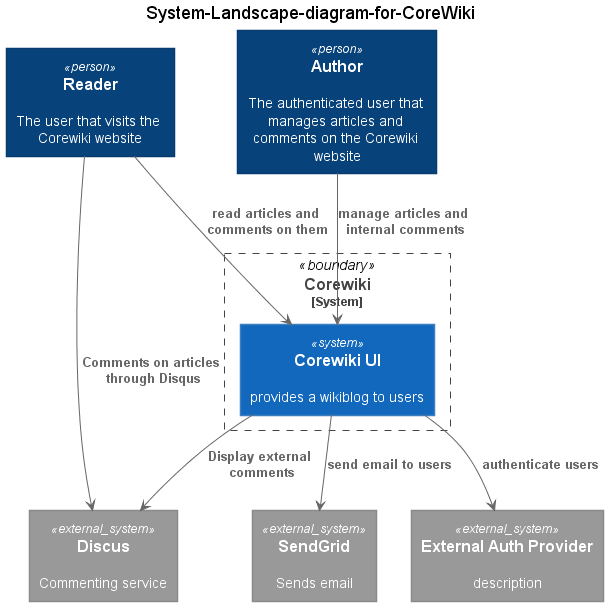

# Core Wiki Context

The CoreWiki offers articles that other visitors can comment on.

Articles are managed by authenticated users only. The authentication is provided by ASP.NET Identity, which can also be configured to provide external auth providers like [Twitter](http://www.twitter.com) and [Facebook](http://www.facebook.com).

Comments can be displayed in a couple of fashions.

- Internal Comments provided by the system
- External comments through [Disqus](http://www.disqus.com)

It also sends out notifications to users by usage of SendGrid, an external email service.

The CoreWiki System is described more in detail in [CoreWiki Containers](2-containers.md)
