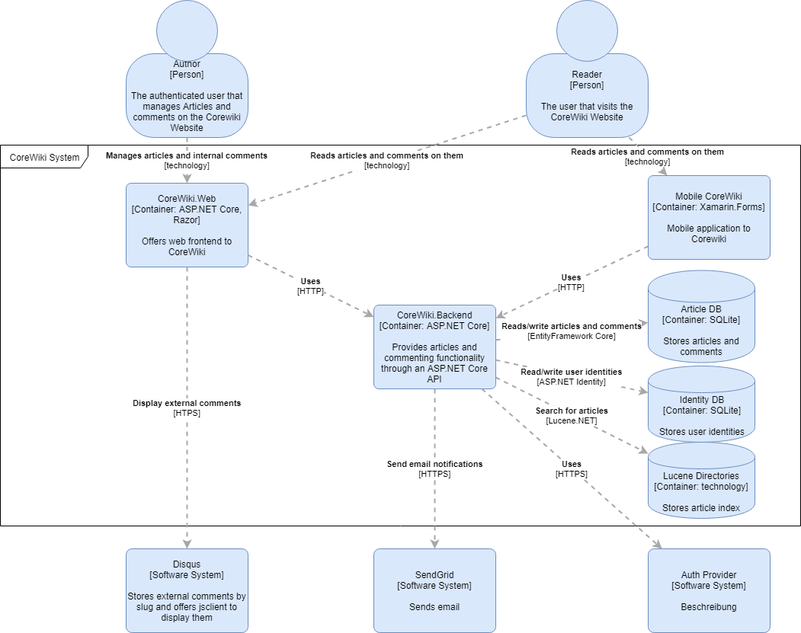

# Core Wiki Containers

Diving a bit deeper, the CoreWiki systemm consist of a couple of components.

- The ASP.NET Web front end, providing Razor Pages
- (A Corewiki Mobile App (not on the roadmap just yet)
- The CoreWiki Backend, which uses the databases
- An articles Database (to store articles and internal comments)
- Identity Database (to store user identities)

