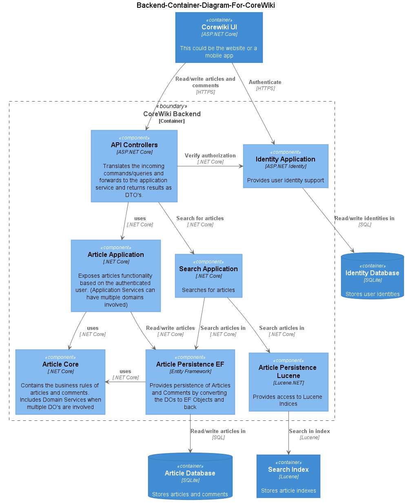

# CoreWiki Backend

The backend is exposed as an HTTP(S) API Service (through ASP.NET). We can choose to expose that API on the same host as the webfront end.

## API Controllers

The API controllers, that expose the API to the outside world, take in a HTTP request and convert those to actual commands and/or queries, sending them to mediatr, where they are picked up by their handlers, who will then (likely) forward those calls to the Article Application Service. This intermediate step allows for:

- We can change the application services interfaces, without having to change the external API interfaces.
- We can support older versions of the external API and redirect them to the newer versions of application services while still supporting the old versions.
- redirection to other (external) services later without the frontend needing to change.

If our application services change, that doesn't force us to change the external API, which would otherwise break clients like the webfrontend or the mobile app otherwise.
You can look at mediatr here as an anti-corruption layer between the clients and the backend.

The handlers use [Automapper](https://automapper.org/) to translate the command/query to a application service dto.

We have an API for :

- Reading articles and commenting on them with internal comments (used by the visitors)
- Writing articles (for the authors who manage the articles).
- Authentication

The API Controllers are described in [API Controllers](4-classes-apicontroller.md)

## Article Application Service(s)

The article application service provide all functionality required to interact with articles. It exposes an interface with its own set of DTO's. Internally, however, it works with Article Aggregates (which consists of Entities and value objects, which in turn are provided by Article.Core), Automapper will map the applicatio dto's to their aggregates. That way it encapsulates the business logic from the rest of the application.
Those aggregates are sent to the Article persistence layer to be persisted for future queries.

> Never expose methods in the interface that aren't working with aggregates. Never act on an entities, only on aggregates.

The application services are described in [Application Services](4-classes-applicationservice.md)

## Article Persistence

The article persistence layer takes in Domain objects (provided by Article.Core) and saves them to the article database. When requested again by the application layer, it fetches again from the DB and returns the result again as an Article Domain Object. (The DAOs are handled by EntityFrameWork, so no mapping is required here.)

The article persistence uses a ReadRepository and a WriteRepository for each aggregate.

## Lucene Persistence

This part exposes the Lucene directories that hold the article index through two repositories, one for searching, one for updating the index.

## Article Core

The Article.Core provides all business logic of articles and comments. It exposes articles aggregates. These aggregates consist of entities and value objects.
