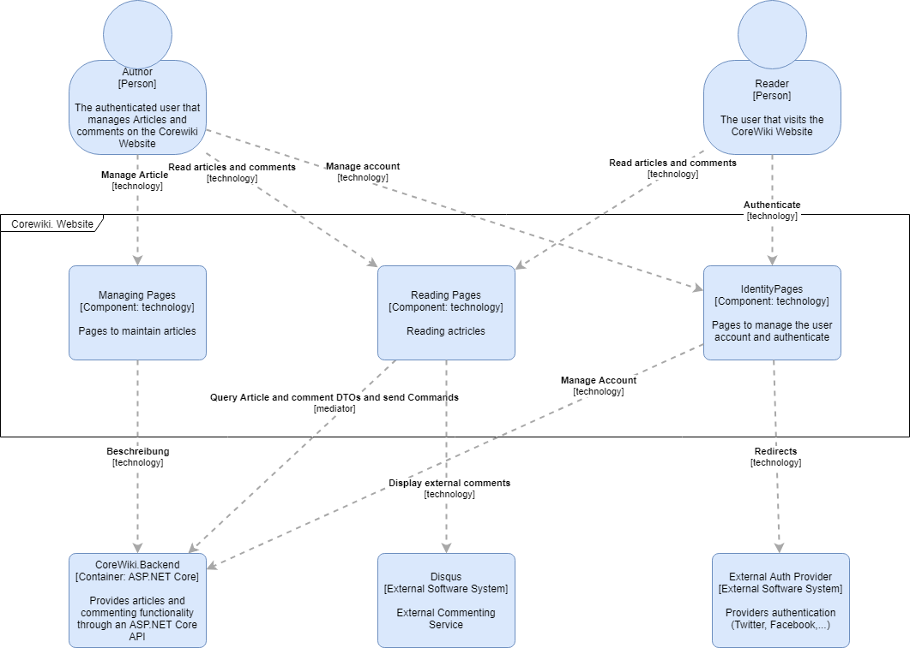

# CoreWiki Web frontend

The Web frontend consists of a set of components.

- Reading Pages: An area where articles can be displayed. This also provides the option for adding comments to a specific article, listing the latest changes and search for existing articles.
- Managing Pages: An area where authenticated users can manage articles.
- Identity Pages: An area providing the visitor a way to manage his/hers account and authenticate against either the internal or external auth provider.

All areas use the Backend service to do their work. There is to be no business logic in any of these areas. All of them are about just displaying content and offer the user a way to interact with it.

The backend can be called through the API provided (if hosted in the same app, then we can call the API controller directly).

The reading page possible also use the [Disqus](http://www.disqus.com) system to display the external comments.

A more general description of how pages are modeled can be found at [RazorPages](4-classes-pages.md)
